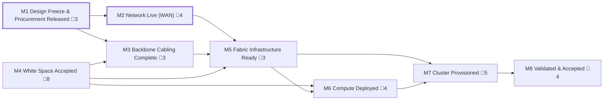

<!-- GENERATED — do not edit. Source: program.yaml -->

# L0 — Data Hall Bring-Up

_Meet-me room to clusters live_

[conventions](conventions.md) · [gates](registers/gates.md) · [dependencies](registers/dependencies.md) · [parallelization](registers/parallelization.md)

## Milestones

| ID | Milestone | Approver | Gates | Depends on | Duration | Float | Status | Detail |
|---|---|---|---|---|---|---|---|---|
| `M1` | Design Freeze & Procurement Released | `PM` | 🚨 3 | — | 36d | 0d | `NOT_STARTED` | [→](L1-milestones/M1.md) |
| `M2` | Network Live (WAN) | `NET-R` | 🚨 4 | `M1` | 95–205d | 0d | `NOT_STARTED` | [→](L1-milestones/M2.md) |
| `M3` | Backbone Cabling Complete | `ICT` | 🚨 3 | `M1`, `M4` | 58d | 97d | `NOT_STARTED` | [→](L1-milestones/M3.md) |
| `M4` | White Space Accepted | `CX` | 🚨 8 | — | 42d | 97d | `NOT_STARTED` | [→](L1-milestones/M4.md) |
| `M5` | Fabric Infrastructure Ready | `NET-R` | 🚨 3 | `M2`, `M3`, `M4` | 35–77d | 48d | `NOT_STARTED` | [→](L1-milestones/M5.md) |
| `M6` | Compute Deployed | `PM` | 🚨 4 | `M4`, `M5` | 93d | 97d | `NOT_STARTED` | [→](L1-milestones/M6.md) |
| `M7` | Cluster Provisioned | `NET-R` | 🚨 5 | `M5`, `M6` | 103–137d | 48d | `NOT_STARTED` | [→](L1-milestones/M7.md) |
| `M8` | Validated & Accepted | `CUST` | 🚨 4 | `M7` | 18–27d | 48d | `NOT_STARTED` | [→](L1-milestones/M8.md) |

_Duration is a span — the milestone's earliest start to its latest finish — not the sum of its tasks. The two figures are the optimistic and pessimistic ends of the authored duration ranges. Float is the tightest slack among the milestone's tasks, pessimistic._

## Dependency graph

_Thick outline marks a milestone on the pessimistic critical path._

## Critical path

**Pessimistic** — 211 days, 19 tasks with zero float.

By milestone: `M1` → `M2`

Full chain (19 tasks)

`M1.1.1` → `M1.1.2` → `M2.1.1` → `M2.1.2` → `M2.1.3` → `M2.2.2` → `M2.2.3` → `M2.2.4` → `M2.4.2` → `M2.4.3` → `M2.5.1` → `M2.5.2` → `M2.5.3` → `M2.6.3` → `M2.6.4` → `M2.8.1` → `M2.8.2` → `M2.8.3` → `M2.8.4`

**Optimistic** — 105 days, 67 tasks with zero float.

By milestone: `M1` → `M3` → `M5` → `M7` → `M8`

Full chain (40 tasks)

`M1.1.1` → `M1.1.2` → `M1.1.3` → `M1.1.5` → `M3.1.1` → `M3.1.2` → `M3.1.3` → `M3.4.1` → `M3.4.2` → `M3.5.1` → `M3.6.1` → `M3.6.2` → `M3.6.3` → `M3.6.4` → `M5.5.1` → `M5.5.2` → `M5.5.3` → `M5.6.1` → `M5.6.2` → `M5.6.3` → `M5.6.4` → `M7.5.1` → `M7.5.2` → `M7.5.3` → `M7.7.2` → `M7.7.3` → `M7.9.1` → `M7.9.2` → `M8.1.1` → `M8.1.2` → `M8.3.1` → `M8.3.2` → `M8.3.3` → `M8.3.4` → `M8.4.1` → `M8.4.2` → `M8.4.3` → `M8.6.1` → `M8.6.2` → `M8.6.3`

_The critical path is not the same path at both ends of the duration ranges. A lane with slack
when everything runs short can become the binding one when things run long, so neither figure
means anything without the label._
