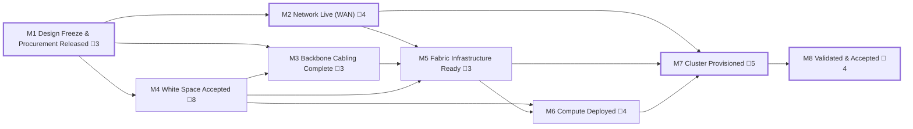

<!-- GENERATED — do not edit. Source: program.yaml -->

# L0 — Data Hall Bring-Up

_Meet-me room to clusters live_

[conventions](conventions.md) · [gates](registers/gates.md) · [dependencies](registers/dependencies.md) · [parallelization](registers/parallelization.md)

## Milestones

| ID | Milestone | Approver | Gates | Depends on | Duration | Float | Status | Detail |
|---|---|---|---|---|---|---|---|---|
| `M1` | Design Freeze & Procurement Released | `PM` | 🚨 3 | — | 36d | 0d | `NOT_STARTED` | [→](L1-milestones/M1.md) |
| `M2` | Network Live (WAN) | `NET-R` | 🚨 4 | `M1` | 95–205d | 0d | `NOT_STARTED` | [→](L1-milestones/M2.md) |
| `M3` | Backbone Cabling Complete | `ICT` | 🚨 3 | `M1`, `M4` | 58d | 133d | `NOT_STARTED` | [→](L1-milestones/M3.md) |
| `M4` | White Space Accepted | `CX` | 🚨 8 | `M1` | 49d | 126d | `NOT_STARTED` | [→](L1-milestones/M4.md) |
| `M5` | Fabric Infrastructure Ready | `NET-R` | 🚨 3 | `M2`, `M3`, `M4` | 32–70d | 84d | `NOT_STARTED` | [→](L1-milestones/M5.md) |
| `M6` | Compute Deployed | `PM` | 🚨 4 | `M4`, `M5` | 97d | 126d | `NOT_STARTED` | [→](L1-milestones/M6.md) |
| `M7` | Cluster Provisioned | `NET-R` | 🚨 5 | `M2`, `M5`, `M6` | 111–221d | 0d | `NOT_STARTED` | [→](L1-milestones/M7.md) |
| `M8` | Validated & Accepted | `CUST` | 🚨 4 | `M7` | 18–27d | 0d | `NOT_STARTED` | [→](L1-milestones/M8.md) |

_Duration is a span — the milestone's earliest start to its latest finish — not the sum of its tasks. The two figures are the optimistic and pessimistic ends of the authored duration ranges. Float is the tightest slack among the milestone's tasks, pessimistic._

## Dependency graph

_Thick outline marks a milestone on the pessimistic critical path._

## Critical path

**Pessimistic** — 247 days, 37 tasks with zero float.

By milestone: `M1` → `M2` → `M7` → `M8`

Full chain (36 tasks)

`M1.1.1` → `M1.1.2` → `M2.1.1` → `M2.1.2` → `M2.1.3` → `M2.2.2` → `M2.2.3` → `M2.2.4` → `M2.4.2` → `M2.4.3` → `M2.5.1` → `M2.5.2` → `M2.5.3` → `M2.6.3` → `M2.6.4` → `M2.8.1` → `M2.8.2` → `M2.8.3` → `M2.8.4` → `M7.7.1` → `M7.7.2` → `M7.7.3` → `M7.9.1` → `M7.9.2` → `M8.1.1` → `M8.1.2` → `M8.3.1` → `M8.3.2` → `M8.3.3` → `M8.3.4` → `M8.4.1` → `M8.4.2` → `M8.4.3` → `M8.6.1` → `M8.6.2` → `M8.6.3`

**Optimistic** — 128 days, 37 tasks with zero float.

By milestone: `M1` → `M2` → `M7` → `M8`

Full chain (36 tasks)

`M1.1.1` → `M1.1.2` → `M2.1.1` → `M2.1.2` → `M2.1.3` → `M2.2.2` → `M2.2.3` → `M2.2.4` → `M2.4.2` → `M2.4.3` → `M2.5.1` → `M2.5.2` → `M2.5.3` → `M2.6.3` → `M2.6.4` → `M2.8.1` → `M2.8.2` → `M2.8.3` → `M2.8.4` → `M7.7.1` → `M7.7.2` → `M7.7.3` → `M7.9.1` → `M7.9.2` → `M8.1.1` → `M8.1.2` → `M8.3.1` → `M8.3.2` → `M8.3.3` → `M8.3.4` → `M8.4.1` → `M8.4.2` → `M8.4.3` → `M8.6.1` → `M8.6.2` → `M8.6.3`

_The critical path is not the same path at both ends of the duration ranges. A lane with slack
when everything runs short can become the binding one when things run long, so neither figure
means anything without the label._

## The design principle

> A **summary** is lossy and terminal — someone compressed the detail and the compression discarded
> the path back. An **abstraction** is lossless and traversable — a view of the underlying material
> where every element resolves downward.

Most program reporting is the first pretending to be the second. That is why *"why is this red?"*
produces a three-day investigation instead of an answer.

These are views of one dataset, not three documents. If a question cannot be answered by traversing
down, that gap is the finding. A number nobody can trace is a number nobody can be held to.

## Why the WAN is the one that kills dates

On power-first sites the WAN is not a provisioning exercise, it is a construction project — permitting,
right-of-way, trenching, splicing, carrier provisioning. It has its own permitting authority and sits
in the carrier's own construction queue, so it can slip entirely independently of the building.

It is also invisible on a construction walk, because nothing about it happens inside the building. The
construction path is what gets reported on precisely because it is the part you can see.

**A data hall that is energized, racked, cabled, and validated but has one WAN path is not
deliverable.** Lease commencement does not care that the inside is finished.

## Definition of done — the contract this whole model serves

> X clusters of X GPUs, at ≥XX% fault-free nodes, ≥XX% uptime sustained over an XX-hour soak,
> ≥XX GB/s bus bandwidth on the XX fabric, accessible to the customer via XX.

Agreed and signed **before** design freeze closes, and measured at acceptance. Every task in this model
exists to make that statement true or false — if a task cannot be traced to it, question why it is here.

## Scope assumptions

64 × GB300 NVL72 · 4,608 GPUs · ~9 MW compute, ~10 MW hall · 100% liquid cooled · scale-out on
ConnectX-8 800G to InfiniBand or Spectrum-X · ~5,000–6,000 field-terminated links · NVLink scale-up
factory-integrated, **not** field work.

Durations are illustrative for a practiced team on a repeat design. First-of-a-kind runs materially
longer, and the delta is almost entirely first-time discovery of things a playbook would have caught.
