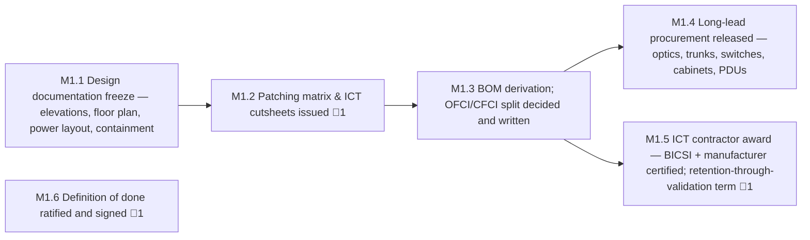

<!-- GENERATED — do not edit. Source: program.yaml -->

# M1 — Design Freeze & Procurement Released

[Program](../L0-program.md) / `M1`

> Everything downstream inherits errors made here. This is the cheapest place in the entire programme
> to be correct and the most expensive place to be wrong.

|  |  |
|---|---|
| Approver | `PM` |
| Status | `NOT_STARTED` |
| Depends on | — |
| Feeds | `M2`, `M3`, `M4` |
| Duration | 36d |
| Float | 0d |
| Gates | 🚨 3 |
| Tasks | 20 |

## Work packages

| ID | Package | Type | Owners | Gates | Depends on | Duration | Status |
|---|---|---|---|---|---|---|---|
| `M1.1` | Design documentation freeze — elevations, floor plan, power layout, containment | DOC | `PM` | — | — | 15d | `NOT_STARTED` |
| `M1.2` | Patching matrix & ICT cutsheets issued | DOC | `NET-R` | 🚨 1 | `M1.1` | 14d | `NOT_STARTED` |
| `M1.3` | BOM derivation; OFCI/CFCI split decided and written | DOC | `PM` | — | `M1.2` | 5d | `NOT_STARTED` |
| `M1.4` | Long-lead procurement released — optics, trunks, switches, cabinets, PDUs | DOC | `PM` | — | `M1.3` | 3d | `NOT_STARTED` |
| `M1.5` | ICT contractor award — BICSI + manufacturer certified; retention-through-validation term | DOC | `PM` | 🚨 1 | `M1.3` | 13d | `NOT_STARTED` |
| `M1.6` | Definition of done ratified and signed | DOC | `CUST` | 🚨 1 | — | 6d | `NOT_STARTED` |

[All tasks →](../L2-tasks/M1-tasks.md)

## Local sequence

## Exit criteria

| Gate | Criterion — what must be evidenced | Evidence | Blocks |
|---|---|---|---|
| 🚨 `M1.2.3` | Patching matrix reviewed as a design artifact — rail alignment, length feasibility, polarity, breakout, pathway fill | Signed review record | `M1.2.4` |
| 🚨 `M1.5.3` | ICT contract executed with retention-through-validation | Executed contract | — |
| 🚨 `M1.6.3` | Definition of done signed by all five parties | Signed document | — |

_Derived from the gate tasks in this milestone. Gate exit is measured, not asserted: if the
criterion is not evidenced, the gate is not closed. **Blocks** lists the immediate successors
that cannot begin until it is._

## Seam notes

**Rail alignment is the failure that hides.** In rail-optimised topologies, GPU *n* in every rack must
land on leaf *n*. Get it wrong in the patching matrix and every link still tests green while collective
bandwidth collapses. It stays invisible through cabling and through certification, and it surfaces only
under full-scale collective measurement — after thousands of terminations have been made. Reviewing the
matrix as a *design artifact*, rather than merely issuing it, is the only cheap opportunity to catch it.

**Contractor retention is a procurement decision that sets validation duration.** Release the structured
cabling contractor at cable-complete, and burn-in finds hundreds of marginal links with nobody on site
to fix them. The clause has to be written before anyone knows they will need it, which is exactly why
it gets dropped.

**"Done" has to be ratified before it can be measured.** If the definition of done was never signed,
acceptance becomes a negotiation conducted under deadline pressure, against criteria drafted once the
result is already known. A criterion authored after the work is not a criterion.

**OFCI/CFCI is a risk allocation, not a purchasing detail.** Whoever owns the boundary owns the delay
when a long-lead item slips, and if that was never written down it is owned by nobody at the moment it
bites.
