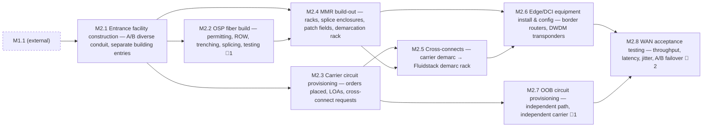

<!-- GENERATED — do not edit. Source: program.yaml -->

# M2 — Network Live (WAN)

[Program](../L0-program.md) / `M2`

> On power-first sites this is a construction project, not a provisioning exercise. It runs on its own
> critical path, with its own permitting authority, and it can slip independently of the building.

|  |  |
|---|---|
| Approver | `NET-R` |
| Status | `NOT_STARTED` |
| Depends on | `M1` |
| Feeds | `M5`, `M7` |
| Duration | 95–205d |
| Float | 0d |
| Gates | 🚨 4 |
| Tasks | 33 |

## Work packages

| ID | Package | Type | Owners | Gates | Depends on | Duration | Status |
|---|---|---|---|---|---|---|---|
| `M2.1` | Entrance facility construction — A/B diverse conduit, separate building entries | PHY | `GC` | — | `M1.1` | 123d | `NOT_STARTED` |
| `M2.2` | OSP fiber build — permitting, ROW, trenching, splicing, testing | PHY | `ICT` + `VEN` | 🚨 1 | `M2.1` | 172d | `NOT_STARTED` |
| `M2.3` | Carrier circuit provisioning — orders placed, LOAs, cross-connect requests | DOC | `NET-R` | — | `M2.1` | 133d | `NOT_STARTED` |
| `M2.4` | MMR build-out — racks, splice enclosures, patch fields, demarcation rack | PHY | `ICT` | — | `M2.1`, `M2.2` | 62d | `NOT_STARTED` |
| `M2.5` | Cross-connects — carrier demarc → Fluidstack demarc rack | HYB | `ICT` + `NET-R` | — | `M2.3`, `M2.4` | 9d | `NOT_STARTED` |
| `M2.6` | Edge/DCI equipment install & config — border routers, DWDM transponders | HYB | `NET-F` + `NET-R` | — | `M2.4`, `M2.5` | 72d | `NOT_STARTED` |
| `M2.7` | OOB circuit provisioning — independent path, independent carrier | HYB | `NET-R` | 🚨 1 | `M2.3` | 99d | `NOT_STARTED` |
| `M2.8` | WAN acceptance testing — throughput, latency, jitter, A/B failover | DIG | `NET-R` | 🚨 2 | `M2.6`, `M2.7` | 5d | `NOT_STARTED` |

[All tasks →](../L2-tasks/M2-tasks.md)

## Local sequence

_Dashed nodes are packages in other milestones that feed this one._

## Exit criteria

| Gate | Criterion — what must be evidenced | Evidence | Blocks |
|---|---|---|---|
| 🚨 `M2.2.6` | Physical path diversity verified by field walk | Route survey + photos | — |
| 🚨 `M2.7.4` | OOB reachable with primary path down | Test record | `M2.8.4`, `M5.4.3` |
| 🚨 `M2.8.3` | A/B failover tested under load | Test record | `M2.8.4` |
| 🚨 `M2.8.4` | WAN acceptance signed | Signed acceptance | `M7.7.1` |

_Derived from the gate tasks in this milestone. Gate exit is measured, not asserted: if the
criterion is not evidenced, the gate is not closed. **Blocks** lists the immediate successors
that cannot begin until it is._

## Seam notes

**Carrier provisioning has the worst lead-time variance in the programme.** Intervals are quoted
optimistically and depend on the carrier's own construction queue, which nobody here controls. Order
early, then track weekly against the carrier's *milestones* rather than against their promise date.
Permitting behaves the same way, for the same reason: no amount of staffing moves an external queue.

**Diversity is asserted more often than it is true.** Two circuits from two carriers routinely share a
conduit, a splice case, or a bridge crossing. Verify the physical path with a field walk — carrier
paperwork describes what was sold, not what was built.

**Failover must be tested under load.** Link-state failover proves the interface notices. It does not
prove the path carries production traffic when the other one drops.

**Out-of-band reachability has to be proven with the primary path down.** An OOB circuit that has only
ever been tested while the production path was up has not been tested.

**This is where the programme most often discovers it is late — too late.** It is invisible on the
construction walk because nothing about it happens inside the building, so it gets tracked separately
and then forgotten. That is the argument for modelling it here rather than adjacent to here.
