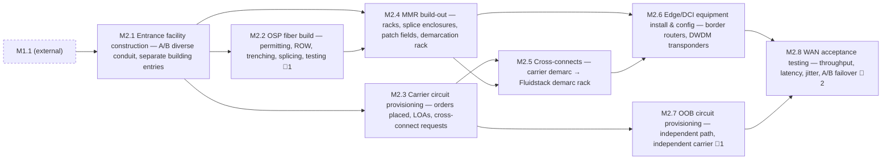

<!-- GENERATED — do not edit. Source: program.yaml -->

# M2 — Network Live (WAN)

[Program](../L0-program.md) / `M2`

|  |  |
|---|---|
| Approver | `NET-R` |
| Status | `NOT_STARTED` |
| Depends on | `M1` |
| Feeds | `M5` |
| Duration | 95–205d |
| Float | 0d |
| Gates | 🚨 4 |
| Tasks | 33 |

## Work packages

| ID | Package | Type | Owners | Gates | Depends on | Duration | Status |
|---|---|---|---|---|---|---|---|
| `M2.1` | Entrance facility construction — A/B diverse conduit, separate building entries | PHY | `GC` | — | `M1.1` | 123d | `NOT_STARTED` |
| `M2.2` | OSP fiber build — permitting, ROW, trenching, splicing, testing | PHY | `ICT` + `VEN` | 🚨 1 | `M2.1` | 172d | `NOT_STARTED` |
| `M2.3` | Carrier circuit provisioning — orders placed, LOAs, cross-connect requests | DOC | `NET-R` | — | `M2.1` | 133d | `NOT_STARTED` |
| `M2.4` | MMR build-out — racks, splice enclosures, patch fields, demarcation rack | PHY | `ICT` | — | `M2.1`, `M2.2` | 62d | `NOT_STARTED` |
| `M2.5` | Cross-connects — carrier demarc → Fluidstack demarc rack | HYB | `ICT` + `NET-R` | — | `M2.3`, `M2.4` | 9d | `NOT_STARTED` |
| `M2.6` | Edge/DCI equipment install & config — border routers, DWDM transponders | HYB | `NET-F` + `NET-R` | — | `M2.4`, `M2.5` | 72d | `NOT_STARTED` |
| `M2.7` | OOB circuit provisioning — independent path, independent carrier | HYB | `NET-R` | 🚨 1 | `M2.3` | 99d | `NOT_STARTED` |
| `M2.8` | WAN acceptance testing — throughput, latency, jitter, A/B failover | DIG | `NET-R` | 🚨 2 | `M2.6`, `M2.7` | 5d | `NOT_STARTED` |

[All tasks →](../L2-tasks/M2-tasks.md)

## Local sequence

_Dashed nodes are packages in other milestones that feed this one._

## Exit criteria

| Gate | Criterion — what must be evidenced | Evidence | Blocks |
|---|---|---|---|
| 🚨 `M2.2.6` | Physical path diversity verified by field walk | Route survey + photos | — |
| 🚨 `M2.7.4` | OOB reachable with primary path down | Test record | `M2.8.4`, `M5.4.3` |
| 🚨 `M2.8.3` | A/B failover tested under load | Test record | `M2.8.4` |
| 🚨 `M2.8.4` | WAN acceptance signed | Signed acceptance | — |

_Derived from the gate tasks in this milestone. Gate exit is measured, not asserted: if the
criterion is not evidenced, the gate is not closed. **Blocks** lists the immediate successors
that cannot begin until it is._
