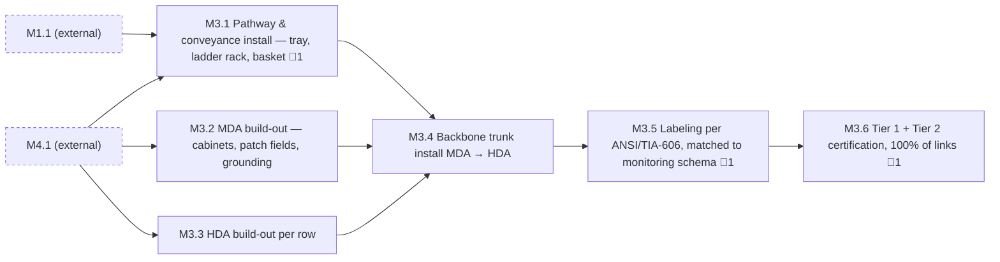

<!-- GENERATED — do not edit. Source: program.yaml -->

# M3 — Backbone Cabling Complete

[Program](../L0-program.md) / `M3`

|  |  |
|---|---|
| Approver | `ICT` |
| Status | `NOT_STARTED` |
| Depends on | `M1`, `M4` |
| Feeds | `M5` |
| Duration | 58d |
| Float | 97d |
| Gates | 🚨 3 |
| Tasks | 18 |

## Work packages

| ID | Package | Type | Owners | Gates | Depends on | Duration | Status |
|---|---|---|---|---|---|---|---|
| `M3.1` | Pathway & conveyance install — tray, ladder rack, basket | PHY | `ICT` | 🚨 1 | `M1.1`, `M4.1` | 16d | `NOT_STARTED` |
| `M3.2` | MDA build-out — cabinets, patch fields, grounding | PHY | `ICT` | — | `M4.1` | 8d | `NOT_STARTED` |
| `M3.3` | HDA build-out per row | PHY | `ICT` | — | `M4.1` | 10d | `NOT_STARTED` |
| `M3.4` | Backbone trunk install MDA → HDA | PHY | `ICT` | — | `M3.1`, `M3.2`, `M3.3` | 13d | `NOT_STARTED` |
| `M3.5` | Labeling per ANSI/TIA-606, matched to monitoring schema | DOC | `ICT` | 🚨 1 | `M3.4` | 4d | `NOT_STARTED` |
| `M3.6` | Tier 1 + Tier 2 certification, 100% of links | DIG | `ICT` | 🚨 1 | `M3.5` | 15d | `NOT_STARTED` |

[All tasks →](../L2-tasks/M3-tasks.md)

## Local sequence

_Dashed nodes are packages in other milestones that feed this one._

## Exit criteria

| Gate | Criterion — what must be evidenced | Evidence | Blocks |
|---|---|---|---|
| 🚨 `M3.1.1` | Overhead coordination resolved on site, three trades present | Coordination walk record | `M3.1.2` |
| 🚨 `M3.5.2` | Label scheme reconciled to monitoring schema | Schema diff | — |
| 🚨 `M3.6.4` | 100% Tier 1 + Tier 2 certification delivered | Certification package | `M3.6.5`, `M5.5.1` |

_Derived from the gate tasks in this milestone. Gate exit is measured, not asserted: if the
criterion is not evidenced, the gate is not closed. **Blocks** lists the immediate successors
that cannot begin until it is._
