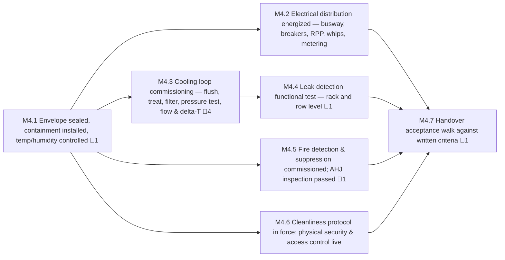

<!-- GENERATED — do not edit. Source: program.yaml -->

# M4 — White Space Accepted

[Program](../L0-program.md) / `M4`

|  |  |
|---|---|
| Approver | `CX` |
| Status | `NOT_STARTED` |
| Depends on | — |
| Feeds | `M3`, `M5`, `M6` |
| Duration | 42d |
| Float | 97d |
| Gates | 🚨 8 |
| Tasks | 27 |

## Work packages

| ID | Package | Type | Owners | Gates | Depends on | Duration | Status |
|---|---|---|---|---|---|---|---|
| `M4.1` | Envelope sealed, containment installed, temp/humidity controlled | PHY | `GC` | 🚨 1 | — | 11d | `NOT_STARTED` |
| `M4.2` | Electrical distribution energized — busway, breakers, RPP, whips, metering | PHY | `ELEC` | — | `M4.1` | 27d | `NOT_STARTED` |
| `M4.3` | Cooling loop commissioning — flush, treat, filter, pressure test, flow & delta-T | PHY | `MECH` + `CX` | 🚨 4 | `M4.1` | 29d | `NOT_STARTED` |
| `M4.4` | Leak detection functional test — rack and row level | HYB | `MECH` + `CX` | 🚨 1 | `M4.3` | 13d | `NOT_STARTED` |
| `M4.5` | Fire detection & suppression commissioned; AHJ inspection passed | PHY | `GC` + `AHJ` | 🚨 1 | `M4.1` | 10d | `NOT_STARTED` |
| `M4.6` | Cleanliness protocol in force; physical security & access control live | PHY | `OPS` + `SEC` | — | `M4.1` | 10d | `NOT_STARTED` |
| `M4.7` | Handover acceptance walk against written criteria | DOC | `CX` + `PM` | 🚨 1 | `M4.2`, `M4.4`, `M4.5`, `M4.6` | 8d | `NOT_STARTED` |

[All tasks →](../L2-tasks/M4-tasks.md)

## Local sequence

## Exit criteria

| Gate | Criterion — what must be evidenced | Evidence | Blocks |
|---|---|---|---|
| 🚨 `M4.1.2` | Hall sealed, dust protocol in force | Inspection record | `M3.1.1`, `M3.2.1`, `M3.3.1`, `M4.1.3`, `M4.2.1`, `M4.3.1`, `M4.6.2` |
| 🚨 `M4.3.3` | Loop flush — particulate to spec | Fluid sample analysis | `M4.3.4` |
| 🚨 `M4.3.4` | Chemical treatment & chemistry verified | Chemistry report | `M4.3.5` |
| 🚨 `M4.3.6` | Pressure test held for spec duration | Pressure log | `M4.3.7` |
| 🚨 `M4.3.7` | Flow rate & delta-T verified under simulated load | Commissioning record | `M4.4.2` |
| 🚨 `M4.4.2` | Leak detection functionally triggered, alarm proven to BMS | Trigger test record | `M4.7.1` |
| 🚨 `M4.5.3` | AHJ inspection passed | AHJ sign-off | `M4.7.1` |
| 🚨 `M4.7.3` | Handover accepted — signed by construction and deployment | Dual-signed acceptance | `M5.1.1`, `M5.2.1`, `M6.3.1` |

_Derived from the gate tasks in this milestone. Gate exit is measured, not asserted: if the
criterion is not evidenced, the gate is not closed. **Blocks** lists the immediate successors
that cannot begin until it is._
