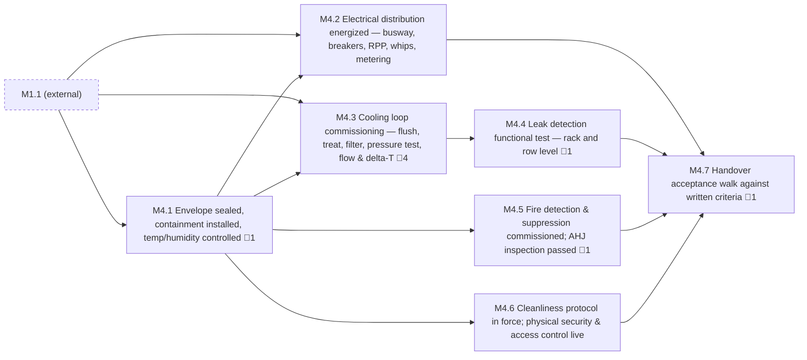

<!-- GENERATED — do not edit. Source: program.yaml -->

# M4 — White Space Accepted

[Program](../L0-program.md) / `M4`

> This is the seam the whole deployment organisation exists on the far side of. Everything before it
> belongs to construction; everything after belongs to deployment. Definitions of "ready" diverge here
> more than anywhere else in the programme.

|  |  |
|---|---|
| Approver | `CX` |
| Status | `NOT_STARTED` |
| Depends on | `M1` |
| Feeds | `M3`, `M5`, `M6` |
| Duration | 49d |
| Float | 126d |
| Gates | 🚨 8 |
| Tasks | 27 |

## Work packages

| ID | Package | Type | Owners | Gates | Depends on | Duration | Status |
|---|---|---|---|---|---|---|---|
| `M4.1` | Envelope sealed, containment installed, temp/humidity controlled | PHY | `GC` | 🚨 1 | `M1.1` | 14d | `NOT_STARTED` |
| `M4.2` | Electrical distribution energized — busway, breakers, RPP, whips, metering | PHY | `ELEC` | — | `M1.1`, `M4.1` | 27d | `NOT_STARTED` |
| `M4.3` | Cooling loop commissioning — flush, treat, filter, pressure test, flow & delta-T | PHY | `MECH` + `CX` | 🚨 4 | `M1.1`, `M4.1` | 29d | `NOT_STARTED` |
| `M4.4` | Leak detection functional test — rack and row level | HYB | `MECH` + `CX` | 🚨 1 | `M4.3` | 13d | `NOT_STARTED` |
| `M4.5` | Fire detection & suppression commissioned; AHJ inspection passed | PHY | `GC` + `AHJ` | 🚨 1 | `M4.1` | 13d | `NOT_STARTED` |
| `M4.6` | Cleanliness protocol in force; physical security & access control live | PHY | `OPS` + `SEC` | — | `M4.1` | 13d | `NOT_STARTED` |
| `M4.7` | Handover acceptance walk against written criteria | DOC | `CX` + `PM` | 🚨 1 | `M4.2`, `M4.4`, `M4.5`, `M4.6` | 8d | `NOT_STARTED` |

[All tasks →](../L2-tasks/M4-tasks.md)

## Local sequence

_Dashed nodes are packages in other milestones that feed this one._

## Exit criteria

| Gate | Criterion — what must be evidenced | Evidence | Blocks |
|---|---|---|---|
| 🚨 `M4.1.2` | Hall sealed, dust protocol in force | Inspection record | `M3.1.1`, `M3.2.1`, `M3.3.1`, `M4.1.3`, `M4.2.1`, `M4.3.1`, `M4.6.2` |
| 🚨 `M4.3.3` | Loop flush — particulate to spec | Fluid sample analysis | `M4.3.4` |
| 🚨 `M4.3.4` | Chemical treatment & chemistry verified | Chemistry report | `M4.3.5` |
| 🚨 `M4.3.6` | Pressure test held for spec duration | Pressure log | `M4.3.7` |
| 🚨 `M4.3.7` | Flow rate & delta-T verified under simulated load | Commissioning record | `M4.4.2` |
| 🚨 `M4.4.2` | Leak detection functionally triggered, alarm proven to BMS | Trigger test record | `M4.7.1` |
| 🚨 `M4.5.3` | AHJ inspection passed | AHJ sign-off | `M4.7.1` |
| 🚨 `M4.7.3` | Handover accepted — signed by construction and deployment | Dual-signed acceptance | `M5.1.1`, `M5.2.1`, `M6.3.1` |

_Derived from the gate tasks in this milestone. Gate exit is measured, not asserted: if the
criterion is not evidenced, the gate is not closed. **Blocks** lists the immediate successors
that cannot begin until it is._

## The rule that does not bend

**Cooling proven before IT energises.** At 130–140 kW per rack there is no air-cooled fallback and no
grace period. A rack energised into an unproven loop is a total-loss event, not a schedule problem.

Fluid commissioning is physically serial — flush, treat, filter, pressure test, flow and delta-T. Each
step needs the prior one genuinely complete, so there is no compression available in this lane no
matter how it is staffed. The only lever is starting it earlier.

Note what "proven" rules out. *Filled* is not *verified against spec*. *Installed* is not *functionally
triggered*. And an alarm that reaches the sensor is not an alarm path confirmed end to end.

## Seam notes

**"Handover" means different things to each party.** To a general contractor it is typically an
*event* — a date, a signature. To deployment it is an *interval* — a process with duration, punch
items, and residual access. Same word, different ontological category, and nobody notices until the
schedule disagrees with itself. Decide which one is meant during design freeze, and require both
signatures on the same document so that the party who benefits from closing the gate is not the only
party closing it.

**Staging is a constrained resource with its own dependency.** An undesignated or unpublished laydown
area is how pallets end up in a corridor and a fire inspection fails — the fit-out team not knowing the
storage room is full of construction material, two teams each doing their own job correctly and sharing
no picture of the same building.
