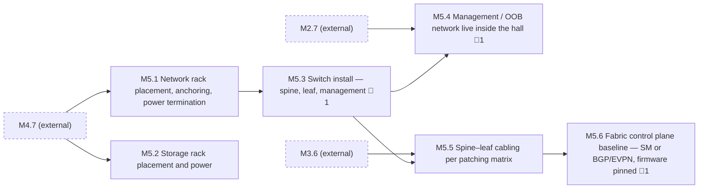

<!-- GENERATED — do not edit. Source: program.yaml -->

# M5 — Fabric Infrastructure Ready

[Program](../L0-program.md) / `M5`

|  |  |
|---|---|
| Approver | `NET-R` |
| Status | `NOT_STARTED` |
| Depends on | `M2`, `M3`, `M4` |
| Feeds | `M6`, `M7` |
| Duration | 35–77d |
| Float | 48d |
| Gates | 🚨 3 |
| Tasks | 20 |

## Work packages

| ID | Package | Type | Owners | Gates | Depends on | Duration | Status |
|---|---|---|---|---|---|---|---|
| `M5.1` | Network rack placement, anchoring, power termination | PHY | `ICT` + `ELEC` | — | `M4.7` | 8d | `NOT_STARTED` |
| `M5.2` | Storage rack placement and power | PHY | `ICT` + `ELEC` | — | `M4.7` | 5d | `NOT_STARTED` |
| `M5.3` | Switch install — spine, leaf, management | PHY | `NET-F` | 🚨 1 | `M5.1` | 6d | `NOT_STARTED` |
| `M5.4` | Management / OOB network live inside the hall | HYB | `NET-F` + `NET-R` | 🚨 1 | `M2.7`, `M5.3` | 67d | `NOT_STARTED` |
| `M5.5` | Spine–leaf cabling per patching matrix | PHY | `ICT` | — | `M3.6`, `M5.3` | 10d | `NOT_STARTED` |
| `M5.6` | Fabric control plane baseline — SM or BGP/EVPN, firmware pinned | DIG | `NET-R` | 🚨 1 | `M5.5` | 8d | `NOT_STARTED` |

[All tasks →](../L2-tasks/M5-tasks.md)

## Local sequence

_Dashed nodes are packages in other milestones that feed this one._

## Exit criteria

| Gate | Criterion — what must be evidenced | Evidence | Blocks |
|---|---|---|---|
| 🚨 `M5.3.4` | Switch firmware baselined to known-good matrix | Version manifest | `M5.5.1` |
| 🚨 `M5.4.3` | OOB proven from remote with production down | Test record | `M7.2.1` |
| 🚨 `M5.6.2` | Topology verified against intended design | Design diff | `M5.6.3` |

_Derived from the gate tasks in this milestone. Gate exit is measured, not asserted: if the
criterion is not evidenced, the gate is not closed. **Blocks** lists the immediate successors
that cannot begin until it is._

> **Network rows go in before compute rows.** This is the sequencing most people get backwards, and
> the cost of getting it wrong is a hall full of racks sitting idle burning schedule while somebody
> configures switches.

## Seam notes

**Out-of-band is the quiet prerequisite nobody schedules.** Without proven OOB, every subsequent fault
needs a body on the floor and remote engineering cannot work the problem at all. It is the least
glamorous work in the programme and among the highest leverage — cheap here, priceless later. Proving
it means reaching the management path *with the production path down*; anything else is an assumption.

**Health is not correctness.** A subnet manager will happily report a fully converged, healthy fabric
that is wired to the wrong design. Verify the discovered topology against the *intended* design, not
against itself. These are different questions and only one of them catches a patching error.

**Firmware baselining is a gate for a reason.** Version drift across a fleet produces faults that look
exactly like hardware failure, and they burn days of triage before anyone thinks to check a version
table.
