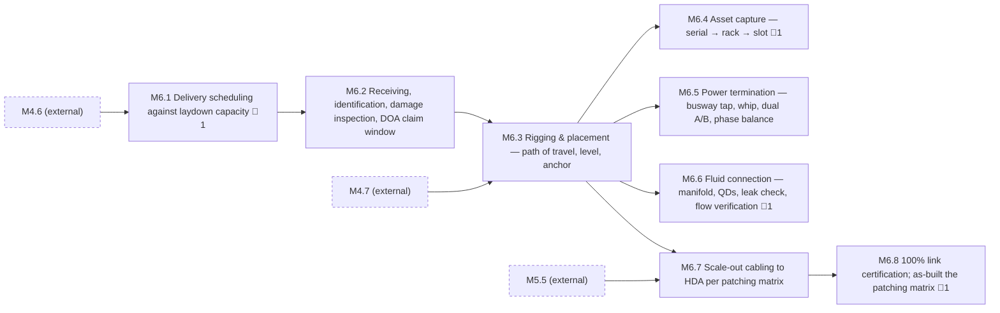

<!-- GENERATED — do not edit. Source: program.yaml -->

# M6 — Compute Deployed

[Program](../L0-program.md) / `M6`

|  |  |
|---|---|
| Approver | `PM` |
| Status | `NOT_STARTED` |
| Depends on | `M4`, `M5` |
| Feeds | `M7` |
| Duration | 93d |
| Float | 97d |
| Gates | 🚨 4 |
| Tasks | 27 |

## Work packages

| ID | Package | Type | Owners | Gates | Depends on | Duration | Status |
|---|---|---|---|---|---|---|---|
| `M6.1` | Delivery scheduling against laydown capacity | DOC | `LOG` | 🚨 1 | `M4.6` | 5d | `NOT_STARTED` |
| `M6.2` | Receiving, identification, damage inspection, DOA claim window | PHY | `LOG` | — | `M6.1` | 6d | `NOT_STARTED` |
| `M6.3` | Rigging & placement — path of travel, level, anchor | PHY | `VEN` + `GC` | — | `M4.7`, `M6.2` | 14d | `NOT_STARTED` |
| `M6.4` | Asset capture — serial → rack → slot | HYB | `OPS` | 🚨 1 | `M6.3` | 6d | `NOT_STARTED` |
| `M6.5` | Power termination — busway tap, whip, dual A/B, phase balance | PHY | `ELEC` | — | `M6.3` | 9d | `NOT_STARTED` |
| `M6.6` | Fluid connection — manifold, QDs, leak check, flow verification | PHY | `MECH` | 🚨 1 | `M6.3` | 12d | `NOT_STARTED` |
| `M6.7` | Scale-out cabling to HDA per patching matrix | PHY | `ICT` | — | `M5.5`, `M6.3` | 19d | `NOT_STARTED` |
| `M6.8` | 100% link certification; as-built the patching matrix | DIG | `ICT` | 🚨 1 | `M6.7` | 12d | `NOT_STARTED` |

[All tasks →](../L2-tasks/M6-tasks.md)

## Local sequence

_Dashed nodes are packages in other milestones that feed this one._

## Exit criteria

| Gate | Criterion — what must be evidenced | Evidence | Blocks |
|---|---|---|---|
| 🚨 `M6.1.3` | Receiving protocol published | Published procedure | `M6.2.1` |
| 🚨 `M6.4.1` | Asset capture at placement — serial → rack → slot | Inventory export | `M6.4.2` |
| 🚨 `M6.6.2` | Leak check per fluid connection | Per-rack record | `M6.6.3` |
| 🚨 `M6.8.3` | Patching matrix updated to as-built | As-built matrix | `M6.8.4`, `M7.4.2` |

_Derived from the gate tasks in this milestone. Gate exit is measured, not asserted: if the
criterion is not evidenced, the gate is not closed. **Blocks** lists the immediate successors
that cannot begin until it is._
