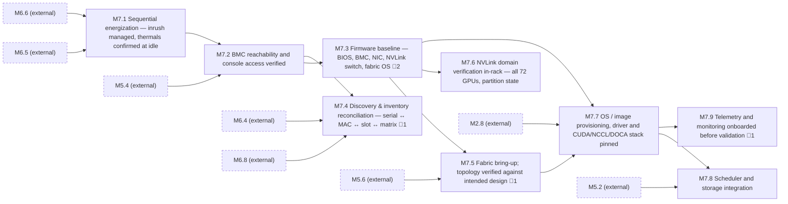

<!-- GENERATED — do not edit. Source: program.yaml -->

# M7 — Cluster Provisioned

[Program](../L0-program.md) / `M7`

> Almost entirely digital work, and the point where remote engineering takes the lead and site
> operations supports. The handoff of who-is-driving happens here.

|  |  |
|---|---|
| Approver | `NET-R` |
| Status | `NOT_STARTED` |
| Depends on | `M2`, `M5`, `M6` |
| Feeds | `M8` |
| Duration | 111–221d |
| Float | 0d |
| Gates | 🚨 5 |
| Tasks | 26 |

## Work packages

| ID | Package | Type | Owners | Gates | Depends on | Duration | Status |
|---|---|---|---|---|---|---|---|
| `M7.1` | Sequential energization — inrush managed, thermals confirmed at idle | HYB | `OPS` + `ELEC` | — | `M6.5`, `M6.6` | 8d | `NOT_STARTED` |
| `M7.2` | BMC reachability and console access verified | DIG | `NET-R` | — | `M5.4`, `M7.1` | 4d | `NOT_STARTED` |
| `M7.3` | Firmware baseline — BIOS, BMC, NIC, NVLink switch, fabric OS | DIG | `NET-R` | 🚨 2 | `M7.2` | 127d | `NOT_STARTED` |
| `M7.4` | Discovery & inventory reconciliation — serial ↔ MAC ↔ slot ↔ matrix | DIG | `NET-R` | 🚨 1 | `M6.4`, `M6.8`, `M7.2` | 5d | `NOT_STARTED` |
| `M7.5` | Fabric bring-up; topology verified against intended design | DIG | `NET-R` | 🚨 1 | `M5.6`, `M7.3` | 5d | `NOT_STARTED` |
| `M7.6` | NVLink domain verification in-rack — all 72 GPUs, partition state | DIG | `NET-R` | — | `M7.3` | 3d | `NOT_STARTED` |
| `M7.7` | OS / image provisioning, driver and CUDA/NCCL/DOCA stack pinned | DIG | `NET-R` | — | `M2.8`, `M7.3`, `M7.5` | 6d | `NOT_STARTED` |
| `M7.8` | Scheduler and storage integration | DIG | `NET-R` | — | `M5.2`, `M7.7` | 4d | `NOT_STARTED` |
| `M7.9` | Telemetry and monitoring onboarded before validation | DIG | `OPS` | 🚨 1 | `M7.7` | 3d | `NOT_STARTED` |

[All tasks →](../L2-tasks/M7-tasks.md)

## Local sequence

_Dashed nodes are packages in other milestones that feed this one._

## Exit criteria

| Gate | Criterion — what must be evidenced | Evidence | Blocks |
|---|---|---|---|
| 🚨 `M7.3.2` | Firmware baselined fleet-wide | Firmware manifest | `M7.3.3` |
| 🚨 `M7.3.3` | Firmware baselined fleet-wide | Firmware manifest | `M7.3.4`, `M7.5.1`, `M7.6.1` |
| 🚨 `M7.4.2` | Inventory reconciled, zero unmatched | Reconciliation report | `M7.4.3` |
| 🚨 `M7.5.3` | Discovered topology diffed against design | Topology diff | `M7.5.4`, `M7.7.2` |
| 🚨 `M7.9.2` | Monitoring live before validation begins | Alert routing test | `M8.1.1`, `M8.2.1` |

_Derived from the gate tasks in this milestone. Gate exit is measured, not asserted: if the
criterion is not evidenced, the gate is not closed. **Blocks** lists the immediate successors
that cannot begin until it is._

## Seam notes

**Firmware before fabric bring-up, without exception.** Version drift produces faults indistinguishable
from hardware failure, and they consume days of triage before someone thinks to check a firmware table.
Baseline first and the subsequent faults are real ones.

**Inventory reconciliation is the highest-leverage hour in the programme.** Reconcile serial to MAC to
rack and slot against the as-built matrix, to zero unmatched assets. Every hour skipped here costs
roughly a day during break/fix, because a fault you cannot locate physically is a fault you cannot fix.

**Verify the discovered topology against the design, not against itself.** A converged fabric that is
wired to the wrong design reports itself as healthy.

**Monitoring goes live before validation begins.** This one is skipped constantly, and it is why
burn-in findings so often cannot be reconstructed afterwards — the data was simply never captured.
Telemetry started after the soak has already discarded the window it was meant to explain.
