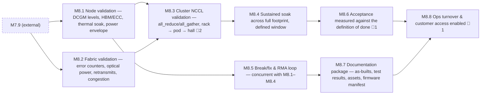

<!-- GENERATED — do not edit. Source: program.yaml -->

# M8 — Validated & Accepted

[Program](../L0-program.md) / `M8`

|  |  |
|---|---|
| Approver | `CUST` |
| Status | `NOT_STARTED` |
| Depends on | `M7` |
| Feeds | — |
| Duration | 18–27d |
| Float | 48d |
| Gates | 🚨 4 |
| Tasks | 33 |

## Work packages

| ID | Package | Type | Owners | Gates | Depends on | Duration | Status |
|---|---|---|---|---|---|---|---|
| `M8.1` | Node validation — DCGM levels, HBM/ECC, thermal soak, power envelope | DIG | `NET-R` | — | `M7.9` | 9d | `NOT_STARTED` |
| `M8.2` | Fabric validation — error counters, optical power, retransmits, congestion | DIG | `NET-R` | — | `M7.9` | 5d | `NOT_STARTED` |
| `M8.3` | Cluster NCCL validation — all_reduce/all_gather, rack → pod → hall | DIG | `NET-R` | 🚨 2 | `M8.1`, `M8.2` | 5d | `NOT_STARTED` |
| `M8.4` | Sustained soak across full footprint, defined window | DIG | `NET-R` | — | `M8.3` | 14d | `NOT_STARTED` |
| `M8.5` | Break/fix & RMA loop — concurrent with M8.1–M8.4 | HYB | `OPS` + `NET-R` | — | `M8.1` | 1d | `NOT_STARTED` |
| `M8.6` | Acceptance measured against the definition of done | DOC | `CUST` + `PM` | 🚨 1 | `M8.4` | 4d | `NOT_STARTED` |
| `M8.7` | Documentation package — as-builts, test results, assets, firmware manifest | DOC | `PM` | — | `M8.5` | 4d | `NOT_STARTED` |
| `M8.8` | Ops turnover & customer access enabled | HYB | `OPS` + `CUST` | 🚨 1 | `M8.6`, `M8.7` | 18d | `NOT_STARTED` |

[All tasks →](../L2-tasks/M8-tasks.md)

## Local sequence

_Dashed nodes are packages in other milestones that feed this one._

## Exit criteria

| Gate | Criterion — what must be evidenced | Evidence | Blocks |
|---|---|---|---|
| 🚨 `M8.3.3` | Full-hall NCCL bandwidth + rail variance analysis | Benchmark results | `M8.3.4` |
| 🚨 `M8.3.4` | Full-hall NCCL bandwidth + rail variance analysis | Benchmark results | `M8.4.1` |
| 🚨 `M8.6.2` | Acceptance measured against definition of done | Evidence pack + signature | `M8.6.3`, `M8.8.4` |
| 🚨 `M8.8.4` | Customer access enabled — clusters live | Access confirmation | — |

_Derived from the gate tasks in this milestone. Gate exit is measured, not asserted: if the
criterion is not evidenced, the gate is not closed. **Blocks** lists the immediate successors
that cannot begin until it is._

> Where committed dates are won or lost. Everything upstream was preparation for a measurement.

## Seam notes

**This is where every upstream error finally becomes visible.** Rail misalignment from the patching
matrix, marginal optics from scale-out cabling, firmware drift from provisioning — all of it surfaces
here as collapsed collective bandwidth, and all of it is expensive here and was cheap upstream.

**Collective bandwidth at full scale is the test that pays for the whole model.** Every link can
certify green individually while the aggregate collapses. Only the collective measurement finds it, and
by then the terminations are months old.

**Acceptance is measured, not asserted.** The definition of done exists precisely so that "done" is not
a matter of anyone's opinion under deadline pressure. Evidence attaches to each criterion, and evidence
without a timestamp cannot be tied to a configuration state.

**Break/fix is not a phase that follows validation — it runs underneath it, continuously.** Treating it
as a subsequent stage is how its duration disappears from the plan.

**Cabling remediation only exists if the retention clause was written.** Without the contractor retained
through validation, faults found here have no owner and the schedule extends while that gets
negotiated from a position of no leverage.

**Failure distribution at scale:** optics and cables dominate by count, then GPU and HBM, then switches,
then power and cooling. Stock spares accordingly — teams reliably over-stock GPUs and under-stock
transceivers.
