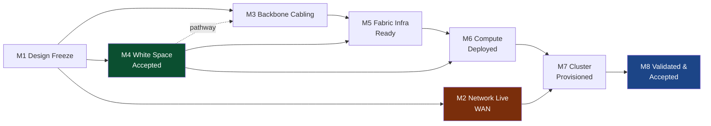

# L0 — Program View
### Data hall bring-up · executive grain

[← README](README.md) · [conventions](conventions.md) · [gates](registers/gates.md) · [dependencies](registers/dependencies.md) · [parallelization](registers/parallelization.md)

---

## Milestones

Every row expands. Click through to the work packages; those expand to tasks.

| ID | Milestone | Gate | Depends on | Duration | Detail |
|---|---|---|---|---|---|
| **M1** | Design Freeze & Procurement Released | 🚨 | — | 2–4 wk | [→](L1-milestones/M1-design-freeze.md) |
| **M2** | Network Live (WAN) | 🚨 | M1 | **12–30 wk** | [→](L1-milestones/M2-network-live.md) |
| **M3** | Backbone Cabling Complete | | M1, M4.1 | 3–5 wk | [→](L1-milestones/M3-backbone-cabling.md) |
| **M4** | White Space Accepted | 🚨 | M1 | 4–8 wk | [→](L1-milestones/M4-white-space-accepted.md) |
| **M5** | Fabric Infrastructure Ready | | M3, M4 | 2–3 wk | [→](L1-milestones/M5-fabric-infrastructure.md) |
| **M6** | Compute Deployed | | M4, M5 | 3–5 wk | [→](L1-milestones/M6-compute-deployed.md) |
| **M7** | Cluster Provisioned | | M6, M2 | 1–2 wk | [→](L1-milestones/M7-cluster-provisioned.md) |
| **M8** | Validated & Accepted | 🚨 | M7 | 2–4 wk | [→](L1-milestones/M8-validated-accepted.md) |

---

## Dependency graph



---

## Critical path

**M1 → M2 → M7 → M8** in most cases — *not* the construction path everyone watches.

M2 (Network Live) is the longest-duration milestone by a wide margin because on power-first sites the
fiber lateral is a construction project of its own: permitting, right-of-way, trenching, splicing,
carrier provisioning. It runs 12–30 weeks and can slip entirely independently of the building.

**A data hall that is energized, racked, cabled, and validated but has one WAN path is not
deliverable.** Lease commencement does not care that the inside is finished.

The construction path (M1 → M4 → M5 → M6 → M7 → M8) is what gets reported on because it's visible.
M2 is the one that kills dates.

---

## Swimlanes — what runs concurrently

```
        wk0        wk8        wk16       wk24       wk28      wk32
        |----------|----------|----------|----------|---------|
M1      ███
M2      ░███████████████████████████████░                        ← own critical path
M3               ░████████░
M4      ░██████████████░
M5                       ░█████░
M6                            ░████████░
M7                                     ░███░
M8                                        ░████████░
        
███ active   ░ float
```

Full detail: [registers/parallelization.md](registers/parallelization.md)

---

## Milestone states

| ID | State | Days in state | Blocked on | Approver |
|---|---|---|---|---|
| M1 | `NOT STARTED` | — | — | PM |
| M2 | `NOT STARTED` | — | M1 | NET-R |
| M3 | `NOT STARTED` | — | M1 | ICT |
| M4 | `NOT STARTED` | — | M1 | CX |
| M5 | `NOT STARTED` | — | M3, M4 | NET-R |
| M6 | `NOT STARTED` | — | M4, M5 | PM |
| M7 | `NOT STARTED` | — | M6, M2 | NET-R |
| M8 | `NOT STARTED` | — | M7 | CUST |

*Reminder from [conventions](conventions.md): `AT RISK` with a mitigation plan does **not** render as
on-track. Aging is displayed by default.*

---

## Definition of done — the contract this whole model serves

> X clusters of X GPUs, at ≥XX% fault-free nodes, ≥XX% uptime sustained over an XX-hour soak,
> ≥XX GB/s bus bandwidth on the XX fabric, accessible to the customer via XX.

Agreed and signed **before** M1 closes. Measured at [M8.6](L2-tasks/M8-tasks.md). Every task below
exists to make this measurable statement true — if a task can't be traced to it, question why it's here.
