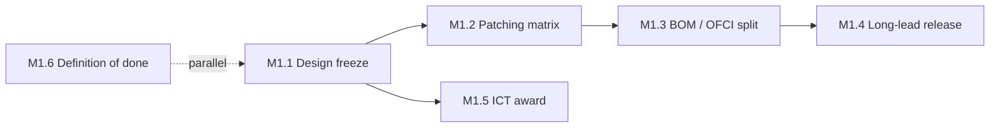

# M1 — Design Freeze & Procurement Released
🚨 **Gate milestone** · [← L0](../L0-program.md) · [tasks →](../L2-tasks/M1-tasks.md)

**Depends on:** — **Feeds:** M2, M3, M4 **Duration:** 2–4 wk **Approver:** PM

> Everything downstream inherits errors made here. This is the cheapest place in the entire program to
> be correct and the most expensive place to be wrong.

## Work packages

| ID | Package | Type | Owner | Feeds |
|---|---|---|---|---|
| M1.1 | Design documentation freeze — elevations, floor plan, power layout, containment | DOC | PM | M1.2, M4 |
| M1.2 | Patching matrix & ICT cutsheets issued | DOC | NET-R | M1.3, M3, M6.7 |
| M1.3 | BOM derivation; **OFCI/CFCI split decided and written** | DOC | PM | M1.4 |
| M1.4 | Long-lead procurement released — optics, trunks, switches, cabinets, PDUs | DOC | PM | M5, M6 |
| M1.5 | ICT contractor award — BICSI + manufacturer certified; **retention-through-validation term** | DOC | PM | M3, M6 |
| M1.6 | 🚨 Definition of done ratified and signed | DOC | CUST | M8.6 |

## Local sequence

## Exit criteria

- Patching matrix reviewed as a **design artifact**, not just issued — rail alignment, length
  feasibility, polarity, breakout consistency, pathway fill all checked
- OFCI/CFCI boundary written, with the delay-risk allocation stated
- ICT contract includes retention through validation with a defined remediation response time
- Definition of done signed by customer, construction, deployment, network, and ops

## Seam notes

**M1.2 → M6.7** is the longest-reach dependency in the program. A rail misalignment introduced in the
patching matrix stays invisible through cabling and certification, then surfaces at
[M8.3](../L2-tasks/M8-tasks.md) as collapsed collective bandwidth — after 5,000 links are terminated.

**M1.5 is a procurement decision that determines M8 duration.** Release the ICT contractor at
cable-complete and burn-in finds two hundred marginal links with nobody on site to fix them.
