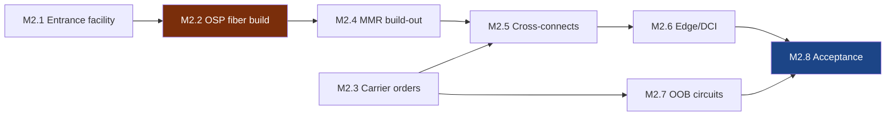

# M2 — Network Live (WAN)
🚨 **Gate milestone · longest pole in the program** · [← L0](../L0-program.md) · [tasks →](../L2-tasks/M2-tasks.md)

**Depends on:** M1 **Feeds:** M7 **Duration:** 12–30 wk **Approver:** NET-R

> On power-first sites this is a construction project, not a provisioning exercise. It runs on its own
> critical path, with its own permitting authority, and it can slip independently of the building.

## Work packages

| ID | Package | Type | Owner | Feeds |
|---|---|---|---|---|
| M2.1 | Entrance facility construction — A/B diverse conduit, separate building entries | PHY | GC | M2.2 |
| M2.2 | OSP fiber build — permitting, ROW, trenching, splicing, testing | PHY | ICT/VEN | M2.4 |
| M2.3 | Carrier circuit provisioning — orders placed, LOAs, cross-connect requests | DOC | NET-R | M2.5 |
| M2.4 | MMR build-out — racks, splice enclosures, patch fields, demarcation rack | PHY | ICT | M2.5 |
| M2.5 | Cross-connects — carrier demarc → Fluidstack demarc rack | HYB | ICT + NET-R | M2.6 |
| M2.6 | Edge/DCI equipment install & config — border routers, DWDM transponders | HYB | NET-F + NET-R | M2.8 |
| M2.7 | OOB circuit provisioning — independent path, independent carrier | HYB | NET-R | M2.8 |
| M2.8 | 🚨 WAN acceptance testing — throughput, latency, jitter, A/B failover | DIG | NET-R | M7 |

## Local sequence

## Exit criteria

- **Two genuinely diverse paths** — physically separate conduit, separate entries, verified by field
  walk not by carrier assertion
- OTDR traces and light levels within budget on every strand, both paths
- Failover tested under load, not just link-state
- OOB reachability proven **with the primary path down**

## Seam notes

**M2.3 has the worst lead-time variance in the program.** Carrier provisioning intervals are quoted
optimistically and depend on the carrier's own construction queue. Order early, then track weekly
against the carrier's milestones rather than their promise date.

**Diversity is asserted more often than it's true.** Two circuits from two carriers routinely share a
conduit, a splice case, or a bridge crossing. Verify the physical path, not the paperwork.

**M2 is where the program most often discovers it is late — too late.** It is invisible on the
construction walk because nothing about it happens inside the building.
