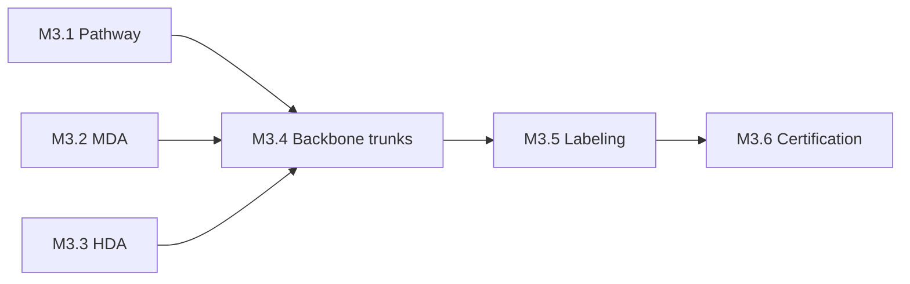

# M3 — Backbone Cabling Complete
[← L0](../L0-program.md) · [tasks →](../L2-tasks/M3-tasks.md)

**Depends on:** M1, M4.1 (envelope) **Feeds:** M5 **Duration:** 3–5 wk **Approver:** ICT

## Work packages

| ID | Package | Type | Owner | Feeds |
|---|---|---|---|---|
| M3.1 | 🚨 Pathway & conveyance install — tray, ladder rack, basket | PHY | ICT | M3.4 |
| M3.2 | MDA build-out — cabinets, patch fields, grounding | PHY | ICT | M3.4 |
| M3.3 | HDA build-out per row | PHY | ICT | M3.4 |
| M3.4 | Backbone trunk install MDA → HDA | PHY | ICT | M3.6 |
| M3.5 | Labeling per ANSI/TIA-606, matched to monitoring schema | DOC | ICT | M3.6 |
| M3.6 | 🚨 Tier 1 + Tier 2 certification, 100% of links | DIG | ICT | M5 |

## Local sequence

## Exit criteria

- 100% link certification — insertion loss and OTDR — delivered as a **payment milestone**
- Labels match what monitoring will report, so a logical alarm resolves to a physical cable without a
  human translating
- As-built records reconcile to the patching matrix

## Seam notes

**M3.1 is the contested one.** Tray competes with mechanical and electrical for overhead space, and the
loser re-works. Coordinate the overhead model before anyone hangs steel — this is a classic seam where
three trades are each executing correctly and the aggregate fails.

**Certification is not testing.** Testing tells you it links. Certification measures against a loss
budget and produces evidence. Only the second one survives a dispute.
