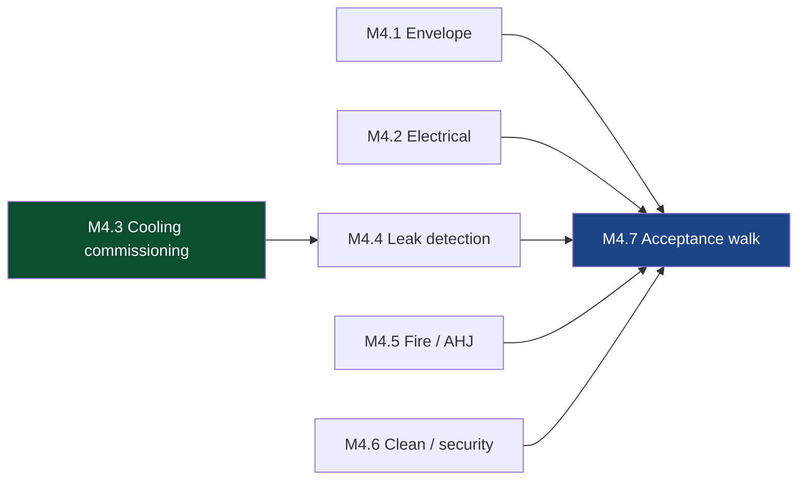

# M4 — White Space Accepted
🚨 **The construction-to-deployment handover** · [← L0](../L0-program.md) · [tasks →](../L2-tasks/M4-tasks.md)

**Depends on:** M1 **Feeds:** M3, M5, M6 **Duration:** 4–8 wk **Approver:** CX

> This is the seam the whole deployment organization exists on the far side of. Everything before it is
> construction's; everything after is deployment's. Definitions of "ready" diverge here more than
> anywhere else in the program.

## Work packages

| ID | Package | Type | Owner | Feeds |
|---|---|---|---|---|
| M4.1 | Envelope sealed, containment installed, temp/humidity controlled | PHY | GC | M3, M4.7 |
| M4.2 | Electrical distribution energized — busway, breakers, RPP, whips, metering | PHY | ELEC | M4.7 |
| M4.3 | 🚨 Cooling loop commissioning — flush, treat, filter, pressure test, flow & delta-T | PHY | MECH/CX | M4.4 |
| M4.4 | 🚨 Leak detection functional test — rack and row level | HYB | MECH/CX | M4.7 |
| M4.5 | Fire detection & suppression commissioned; AHJ inspection passed | PHY | GC/AHJ | M4.7 |
| M4.6 | Cleanliness protocol in force; physical security & access control live | PHY | OPS/SEC | M4.7 |
| M4.7 | 🚨 Handover acceptance walk against written criteria | DOC | CX + PM | M5, M6 |

## Local sequence

## Exit criteria

**🚨 The rule that does not bend: cooling loop proven before any IT equipment energizes.** At 130–140
kW/rack there is no air-cooled fallback and no grace period.

- Fluid chemistry verified against spec, not just "filled"
- Flow rate and delta-T verified under simulated load
- Leak detection functionally triggered, not merely installed
- Written handover criteria signed by construction **and** deployment — both signatures, same document

## Seam notes

**"Handover" means different things to each party.** To a GC it is typically an *event* — a date, a
signature. To deployment it is an *interval* — a process with duration, punch items, and residual
access. Same word, different ontological category, and nobody notices until the schedule disagrees with
itself. Define which one you mean at [M1.6](M1-design-freeze.md).

**M4.6 is where the fire-inspection failure lives.** Pallets staged in a corridor because the fit-out
team didn't know the storage room was full of construction material — two teams each doing their job
correctly, sharing no picture of the same building.
