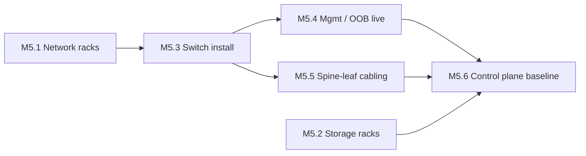

# M5 — Fabric Infrastructure Ready
[← L0](../L0-program.md) · [tasks →](../L2-tasks/M5-tasks.md)

**Depends on:** M3, M4 **Feeds:** M6 **Duration:** 2–3 wk **Approver:** NET-R

> **Network rows go in before compute rows.** The sequencing most people get backwards — and the cost of
> getting it wrong is 64 racks sitting idle burning schedule while someone configures switches.

## Work packages

| ID | Package | Type | Owner | Feeds |
|---|---|---|---|---|
| M5.1 | Network rack placement, anchoring, power termination | PHY | ICT/ELEC | M5.3 |
| M5.2 | Storage rack placement and power | PHY | ICT/ELEC | M5.6 |
| M5.3 | Switch install — spine, leaf, management | PHY | NET-F | M5.4, M5.5 |
| M5.4 | 🚨 Management / OOB network live inside the hall | HYB | NET-F + NET-R | M5.6, M7 |
| M5.5 | Spine–leaf cabling per patching matrix | PHY | ICT | M5.6 |
| M5.6 | Fabric control plane baseline — SM or BGP/EVPN, firmware pinned | DIG | NET-R | M6 |

## Local sequence

## Exit criteria

- Every leaf port intended for compute is configured, up, and **verified against the intended design**,
  not merely against itself
- Switch firmware pinned to a known-good matrix and recorded
- OOB reachable independently of the production fabric — provable by taking production down

## Seam notes

**M5.4 is the quiet prerequisite for everything in M7.** If OOB isn't solid before compute arrives,
every subsequent fault requires physical presence, and remote engineering can't work the problem at all.
It is the least glamorous package in the program and among the highest leverage.

**Verify topology against intent.** A subnet manager will happily report a healthy, fully-converged
fabric that is wired to the wrong design. Health and correctness are different questions.
