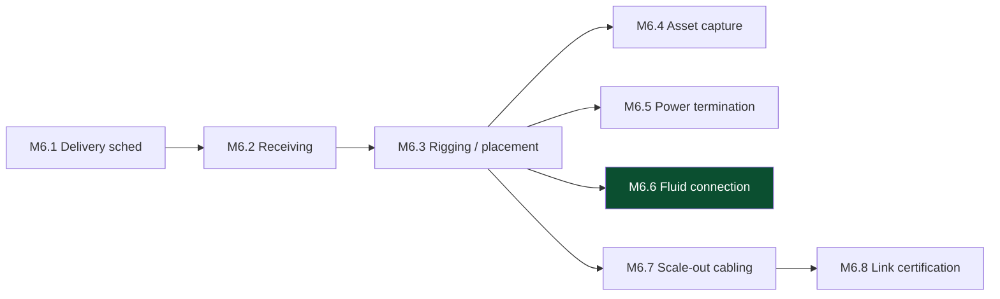

# M6 — Compute Deployed
[← L0](../L0-program.md) · [tasks →](../L2-tasks/M6-tasks.md)

**Depends on:** M4, M5 **Feeds:** M7 **Duration:** 3–5 wk **Approver:** PM

> 64 racks at ~1.3–1.5 t each, factory-integrated. This is receive → position → connect, not build.
> Throughput ≈ 8–12 racks/day with good logistics.

## Work packages

| ID | Package | Type | Owner | Feeds |
|---|---|---|---|---|
| M6.1 | Delivery scheduling against **laydown capacity** | DOC | LOG | M6.2 |
| M6.2 | Receiving, identification, damage inspection, DOA claim window | PHY | LOG | M6.3 |
| M6.3 | Rigging & placement — path of travel, level, anchor | PHY | VEN/GC | M6.4 |
| M6.4 | 🚨 Asset capture — serial → rack → slot | HYB | OPS | M7.4 |
| M6.5 | Power termination — busway tap, whip, dual A/B, phase balance | PHY | ELEC | M7.1 |
| M6.6 | 🚨 Fluid connection — manifold, QDs, leak check, flow verification | PHY | MECH | M7.1 |
| M6.7 | Scale-out cabling to HDA per patching matrix | PHY | ICT | M6.8 |
| M6.8 | 🚨 100% link certification; **as-built the patching matrix** | DIG | ICT | M7.5 |

## Local sequence

M6.5, M6.6, M6.7 run **concurrently per rack** but compete for floor space and access. Sequence by rack,
not by trade, or three crews will queue behind each other in the same aisle.

## Exit criteria

- Asset genealogy complete and reconcilable — capturing it later costs roughly ten times more
- Every fluid connection leak-checked individually, flow and delta-T verified under load
- 100% of scale-out links certified, results delivered
- **Patching matrix updated to as-built** — not the issued version

## Seam notes

**M6.2 is the semi-turned-around failure.** A truck of network racks sent away because the person at the
gate didn't know what was on it. The fix is a receiving protocol that doesn't depend on recognition —
delivery notification, identification, routing.

**M6.7 carries the rail-alignment risk introduced back at [M1.2](M1-design-freeze.md).** Nothing in this
milestone will detect it. It surfaces at [M8.3](M8-validated-accepted.md).
