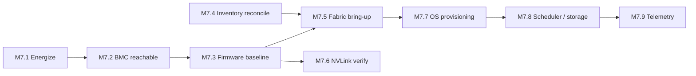

# M7 — Cluster Provisioned
[← L0](../L0-program.md) · [tasks →](../L2-tasks/M7-tasks.md)

**Depends on:** M6, **M2** **Feeds:** M8 **Duration:** 1–2 wk **Approver:** NET-R

> Almost entirely digital work, and the first milestone where remote engineering leads and site
> operations supports. The handoff of who-is-driving happens here.

## Work packages

| ID | Package | Type | Owner | Feeds |
|---|---|---|---|---|
| M7.1 | Sequential energization — inrush managed, thermals confirmed at idle | HYB | OPS + ELEC | M7.2 |
| M7.2 | BMC reachability and console access verified | DIG | NET-R | M7.3 |
| M7.3 | 🚨 Firmware baseline — BIOS, BMC, NIC, NVLink switch, fabric OS | DIG | NET-R | M7.5 |
| M7.4 | 🚨 Discovery & inventory reconciliation — serial ↔ MAC ↔ slot ↔ matrix | DIG | NET-R | M7.5 |
| M7.5 | Fabric bring-up; **topology verified against intended design** | DIG | NET-R | M7.7 |
| M7.6 | NVLink domain verification in-rack — all 72 GPUs, partition state | DIG | NET-R | M8.1 |
| M7.7 | OS / image provisioning, driver and CUDA/NCCL/DOCA stack pinned | DIG | NET-R | M7.8 |
| M7.8 | Scheduler and storage integration | DIG | NET-R | M8 |
| M7.9 | Telemetry and monitoring onboarded **before** validation | DIG | OPS | M8 |

## Local sequence

## Exit criteria

- Firmware matrix recorded and uniform across the fleet
- Inventory reconciles with zero unmatched assets
- Fabric topology matches the design document, verified explicitly
- Telemetry capturing **before** M8 begins, so burn-in data actually exists

## Seam notes

**M7.3 before M7.5, always.** Version drift across a fleet produces faults that look exactly like
hardware and consume days of triage before someone thinks to check a firmware table.

**M7.4 is the highest-leverage hour in the program.** A fault you can't locate physically is a fault you
can't fix. Every hour skipped here costs roughly a day during [M8.5](M8-validated-accepted.md).

**M7.9 is skipped constantly** and it is why burn-in findings so often can't be reconstructed afterward.
