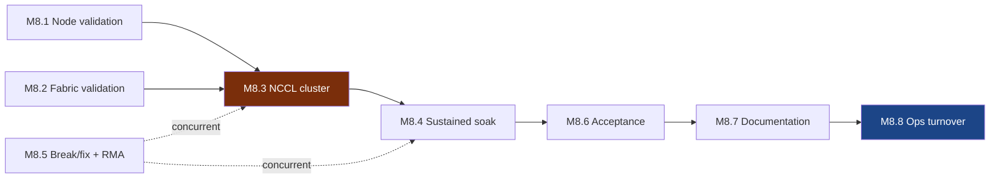

# M8 — Validated & Accepted
🚨 **Terminal gate** · [← L0](../L0-program.md) · [tasks →](../L2-tasks/M8-tasks.md)

**Depends on:** M7 **Feeds:** revenue **Duration:** 2–4 wk **Approver:** CUST

> Where committed dates are won or lost. Everything upstream was preparation for a measurement.

## Work packages

| ID | Package | Type | Owner | Feeds |
|---|---|---|---|---|
| M8.1 | Node validation — DCGM levels, HBM/ECC, thermal soak, power envelope | DIG | NET-R | M8.5 |
| M8.2 | Fabric validation — error counters, optical power, retransmits, congestion | DIG | NET-R | M8.5 |
| M8.3 | 🚨 Cluster NCCL validation — all_reduce/all_gather, rack → pod → hall | DIG | NET-R | M8.4 |
| M8.4 | Sustained soak across full footprint, defined window | DIG | NET-R | M8.6 |
| M8.5 | Break/fix & RMA loop — concurrent with M8.1–M8.4 | HYB | OPS + NET-R | M8.6 |
| M8.6 | 🚨 Acceptance measured against the definition of done | DOC | CUST + PM | M8.7 |
| M8.7 | Documentation package — as-builts, test results, assets, firmware manifest | DOC | PM | M8.8 |
| M8.8 | Ops turnover & customer access enabled | HYB | OPS + CUST | **live** |

## Local sequence

## Exit criteria

Measured against the definition of done ratified at [M1.6](M1-design-freeze.md):

> X clusters of X GPUs, ≥XX% fault-free nodes, ≥XX% uptime over an XX-hour soak, ≥XX GB/s bus bandwidth
> on the XX fabric, accessible to the customer via XX.

**Measured, not asserted.** Evidence attached to each criterion.

## Seam notes

**M8.3 is where every upstream error finally becomes visible.** Rail misalignment from
[M1.2](M1-design-freeze.md), marginal optics from [M6.7](M6-compute-deployed.md), firmware drift from
[M7.3](M7-cluster-provisioned.md) — all of it surfaces as collapsed collective bandwidth, and all of it
is expensive here and cheap upstream.

**M8.5 needs the ICT contractor on site.** If [M1.5](M1-design-freeze.md) released them at
cable-complete, this is where the program discovers that decision.

**Failure distribution:** optics and cables dominate by count, then GPU/HBM, then switches, then power
and cooling. Stock spares accordingly — teams over-stock GPUs and under-stock transceivers.
